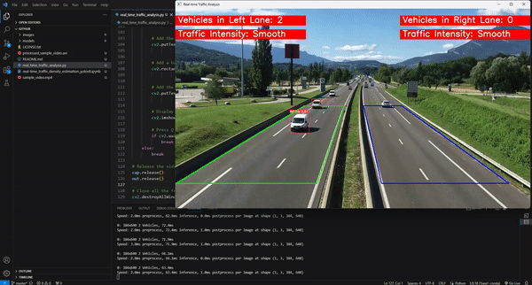

# 🚗 Real-Time Traffic Density Estimation with YOLOv8


## 🔍 Overview
This project harnesses the power of YOLOv8's real-time detection capabilities to tackle Traffic Density Estimation, a crucial aspect of urban and traffic management systems. The primary objective is to accurately count vehicles within designated areas in video frames to evaluate traffic flow. The insights garnered from this data are instrumental in pinpointing peak traffic times, identifying bottlenecks, and aiding urban planning. We have crafted an extensive toolkit that provides in-depth analysis of traffic patterns, thereby augmenting traffic control and city planning endeavors.


## 🎯 Objectives
The pivotal milestones achieved in our project include:
* **YOLOv8 Model Selection and Assessment:** Commencing with the selection of a pre-trained YOLOv8 model and evaluating its baseline performance on the COCO dataset for vehicle detection purposes.
* **Specialized Vehicle Dataset Curation:** Assembling and annotating a targeted dataset dedicated to vehicles to enhance the model's detection accuracy for a range of vehicle types.
* **Model Refinement for Superior Detection:** Applying transfer learning techniques to fine-tune the YOLOv8 model, with a special focus on detecting vehicles from aerial views, thus significantly improving precision and recall rates.
* **Thorough Evaluation of Model Performance:** Conducting a detailed analysis of learning curves, confusion matrices, and performance metrics to ensure the model's reliability and its capability to generalize.
* **Generalization and Inference on Test Data:** Verifying the model's robustness through generalization tests using validation images, an unseen test image, and a test video, showcasing its real-world applicability and efficiency.
* **Real-Time Traffic Analysis:** Developing an algorithm to quantify traffic density by real-time vehicle counting and traffic intensity analysis on test video footage.
* **Preparation for Cross-Platform Deployment:** Exporting the optimized model in the ONNX format to ensure cross-platform compatibility and facilitate deployment across diverse environments.


## 📚 Dataset Description

### 🌐 Overview
The **Top-View Vehicle Detection Image Dataset for YOLOv8** is essential for tasks like traffic monitoring and urban planning. It provides a unique perspective on vehicle behavior and traffic patterns from aerial views, facilitating the creation of AI models that can understand and analyze traffic flow comprehensively.

### 🔍 Specifications 
- 🚗 **Class**: 'Vehicle' including cars, trucks, and buses.
- 🖼️ **Total Images**: 626
- 📏 **Image Dimensions**: 640x640 pixels
- 📂 **Format**: YOLOv8 annotation format

### 🔄 Pre-processing
Each image is carefully pre-processed and standardized to ensure consistency and high-quality training data for our model.

### 🔢 Dataset Split
The dataset is meticulously split into:
- **Training Set**: 536 images for model training with diverse scenarios.
- **Validation Set**: 90 images for unbiased model performance evaluation.

### 🎭 Augmentation on Training Set
Augmentations, including horizontal flips, are applied to enhance the training set's robustness, ensuring the model learns to generalize well across varied traffic conditions.

### 🚀 Significance
This dataset is pivotal in developing sophisticated vehicle detection models and shaping intelligent transportation systems for smarter city infrastructures.

### 🗃️ Sources
- The dataset is curated from [Pexels](https://www.pexels.com/search/videos/), offering diverse top-view videos for a rich vehicle detection dataset.
- Images were extracted using [Roboflow](https://universe.roboflow.com/farzad/vehicle_detection_yolov8) at a rate of 1 frame per second, ensuring a wide variety of vehicle types and scenarios.

### 📌 Access
The dataset is publicly available on Roboflow and Kaggle:
- Roboflow Project: [Top-View Vehicle Detection](https://universe.roboflow.com/farzad/vehicle_detection_yolov8)
- Kaggle Dataset: [Top-View Vehicle Detection Image Dataset](https://www.kaggle.com/datasets/farzadnekouei/top-view-vehicle-detection-image-dataset)


## 🎥 YouTube Demo
Real-Time Traffic Density Estimation with YOLOv8 in Action:

[](https://youtu.be/5SxQfWLENh8)


## 📁 File Descriptions

- **`images/`**: This directory houses the cover images for the project and the sample image utilized within the notebook.
- **`models/`**: Contains the best-performing fine-tuned YOLOv8 model in both `.pt` (PyTorch format) and `.onnx` (Open Neural Network Exchange format) for broad compatibility.
- **`LICENSE`**: The legal framework defining the terms under which this project's code and dataset can be used.
- **`README.md`**: The document you are reading that offers an insightful overview and essential information about the project.
- **`real_time_traffic_analysis.py`**: The Python script for deploying the YOLOv8 model to estimate traffic density in real-time on a local system.
- **`real-time_traffic_density_estimation_yolov8.ipynb`**: The Jupyter notebook that documents the model development pipeline, from data preparation to model evaluation and inference.
- **`Running_Real-Time_Traffic_Analysis.gif`**: A GIF demonstration showing the real-time traffic analysis capability of our model when the `real_time_traffic_analysis.py` script is executed.
- **`sample_video.mp4`**: The video file used for testing the traffic estimation algorithm and the deployment code in `real_time_traffic_analysis.py`.


## 🚀 Instructions for Local Execution

To experience the full capabilities of the YOLOv8 Traffic Density Estimation project on your local machine, follow these steps:

### 1️⃣. Initial Setup
1. **Clone the Repository**: Start by cloning the project repository to your local system using the command below:
    ```bash
    git clone https://github.com/FarzadNekouee/YOLOv8_Traffic_Density_Estimation.git
    ```
2. **Navigate to the Project Directory**: After cloning, change into the project directory with:
    ```bash
    cd YOLOv8_Traffic_Density_Estimation
    ```

### 2️⃣. Exploring the Model Development Pipeline
Get hands-on with the model development process and see the results of traffic density estimation:
1. **Download the Dataset**: Access the dataset from [Kaggle](https://www.kaggle.com/datasets/farzadnekouei/top-view-vehicle-detection-image-dataset). Download and extract it to a known directory on your machine.
2. **Open the Notebook**: Launch Jupyter Notebook or JupyterLab and open `real-time_traffic_density_estimation_yolov8.ipynb` to explore the model development pipeline.
3. **Install Dependencies**: Ensure all necessary Python libraries are installed for flawless execution.
4. **Update Paths**: Update the paths in the notebook for the dataset, sample image, and sample video to their respective locations on your local system.
5. **Run the Notebook**: Execute all cells in the notebook to step through the data preprocessing, model training, and evaluation phases.

### 3️⃣. Watching the Real-Time Performance
Witness the real-time traffic analysis capability of our YOLOv8 model:
1. **Install Ultralytics YOLO**: Ensure you have the `ultralytics` package installed by running:
    ```bash
    pip install ultralytics
    ```
2. **Run the Analysis Script**: Execute the script to start the real-time traffic density estimation:
    ```bash
    python real_time_traffic_analysis.py
    ```
3. **Real-Time Analysis**: The video window will display the live traffic analysis. To exit, simply press 'q' while the video window is active.

This GIF showcases our algorithm running in real-time:

 


## 🔗 Additional Resources

- 🎥 **Project Demo**: Watch the live demonstration of this project on [YouTube](https://www.youtube.com/watch?v=5SxQfWLENh8).
- 🌐 **Kaggle Notebook**: Interested in a Kaggle environment? Explore the notebook [here](https://www.kaggle.com/code/farzadnekouei/real-time-traffic-density-estimation-with-yolov8).
- 🌐 **Dataset Source**: Available on both [Roboflow](https://universe.roboflow.com/farzad/vehicle_detection_yolov8) and [Kaggle](https://www.kaggle.com/datasets/farzadnekouei/top-view-vehicle-detection-image-dataset).
- 🤝 **Connect on LinkedIn**: Have questions or looking for collaboration? Let's connect on [LinkedIn](https://linkedin.com/in/farzad-nekouei-7535aa53/).